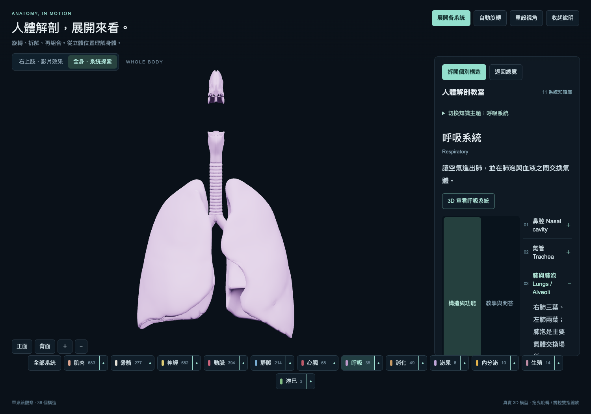

# 人體解剖教室 · 3D 與知識整合版

以 3D 模型為主，整合 11 大系統的構造功能、教學提示及課堂問答。可直接部署至 GitHub Pages，網站運行不需要後端、API 金鑰或第三方模型服務。



## 上傳 GitHub 並開啟網站

1. 解壓縮交付的 ZIP。在 GitHub 建立儲存庫（例如 `anatomy-teaching`）。
2. 將解壓後的**資料夾內容**上傳到儲存庫根目錄。不要只上傳 ZIP，也不要再多包一層資料夾。儲存庫根目錄應看得到 `README.md` 和 `docs`。
3. 在儲存庫開啟 **Settings → Pages**。
4. Source 選 **Deploy from a branch**，Branch 選 **main**，資料夾選 **/docs**，按 **Save**。
5. 等待 GitHub 完成發布後，用 Pages 頁面顯示的網站網址開啟。

`docs` 已完成編譯，首次上傳不必安裝 Node.js 或執行指令。網址通常為 `https://你的帳號.github.io/儲存庫名稱/`，請以 GitHub 顯示的實際網址為準。

每個檔案皆低於 25 MiB，可使用 GitHub 網頁上傳；不需要 Git LFS。GitHub 若限制一次上傳數量，可分批上傳，保持目錄結構。ZIP 是傳送用壓縮包，不是網站發布檔案。

官方說明：[設定發布來源](https://docs.github.com/en/pages/getting-started-with-github-pages/configuring-a-publishing-source-for-your-github-pages-site) · [檔案大小限制](https://docs.github.com/en/repositories/working-with-files/managing-large-files/about-large-files-on-github)

## 上課操作

- **右上肢**：切換肌肉、骨骼、神經、動脈、靜脈；展開與組合，或拆開單一系統的個別構造。
- **全身**：探索各系統，拖曳旋轉、滾輪縮放，點擊構造查看名稱。
- **右側知識面板**：選取 3D 系統後，同步閱讀該系統的構造、功能、教學引導與課堂問答。
- **切換知識主題**：全部 11 個系統都能在同一頁閱讀；「3D 查看」可切換至對應模型。
- **教學與問答**：先提出問題，再按「顯示解答」。
- **收起說明**：擴大 3D 展示空間；手機可隨時收合知識面板。

展開與拆解會改變構造顯示位置。講解正常解剖關係時，請先組合模型。

## 範圍

右上肢包含 246 個可選構造；全身包含 2,340 個可選構造。這些是資料集的構造數，不是器官數或骨骼數。

11 大系統文字知識均已整合。3D 全身模型為男性；皮膚及女性生殖構造尚無 3D 模型。淋巴圖層目前為脾臟與胸腺，未含完整淋巴管網。常用構造提供繁體中文，其他細部名稱保留模型英文。

## 資料夾

- `docs/`：直接交給 GitHub Pages 的完整網站。
- `app/Studio.tsx`、`app/Knowledge.tsx`：3D 頁面與知識面板原始碼。
- `app/anatomy-engine.js`：3D 載入、旋轉、選取與拆解。
- `app/anatomy-knowledge.ts`：11 系統教學內容。
- `public/models/`、`public/draco/`：建立網站所需的模型及解碼器原檔。
- `scripts/build-pages.mjs`：將網站輸出至 `docs/`。
- `validation/`：驗證紀錄與瀏覽器測試。

原始模型和網站發布模型各保留一份，前者用於重新建置，後者用於 Pages。`node_modules`、編譯暫存、舊版 HTML 與 ZIP 不需要上傳，交付 ZIP 已排除。

## 本機預覽與修改

只想預覽發布版，在此資料夾執行：

```sh
python3 -m http.server 8080 --directory docs
```

瀏覽器開啟 `http://localhost:8080/`。發布版會分別讀取模型，因此請用 HTTP 伺服器，不要雙擊 `docs/index.html`。

修改原始碼需 Node.js 22.13 以上及 pnpm：

```sh
pnpm install --frozen-lockfile
pnpm run dev
```

修改完成後重新建立 Pages 檔案：

```sh
pnpm run build:pages
```

將更新後的原始碼與 `docs/` 一起提交至 GitHub。Pages 會發布已提交的 `docs/`，不會自行編譯 `app/`。

## 授權與模型來源

請保留 [ATTRIBUTION.md](ATTRIBUTION.md) 及 [THIRD_PARTY_LICENSES.txt](THIRD_PARTY_LICENSES.txt)。模型來自 Z-Anatomy / BodyParts3D / Open 3D Model；教學內容參考 OpenStax。部分來源有非商業使用限制，不能把整包視為無限制商用模型。

模型可能有簡化、缺漏或解剖誤差，供解剖教學，不作臨床定位依據。

## 驗證

2026-09-18：在 `/docs/` 子目錄模擬 GitHub Pages，檢查模型載入、系統與知識連動、11 個主題、問答揭示、跨上肢／全身切換、手機面板。詳見 `validation/pages-result.json`。
